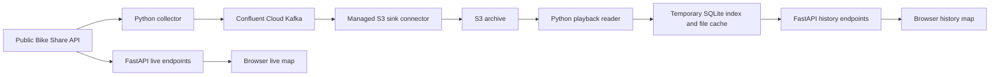

# How this project works

Start here before reading the caching and concurrency code. The project has three
separate paths: collecting observations, showing the live map, and replaying history.

Flink is not running in this project. The S3 connector is configured in Confluent
Cloud; the collector does not upload archive files itself. The live map reads the
public API directly, so seeing a working live map does not prove Kafka is healthy.

## Suggested reading order

| File | Question it answers |
| --- | --- |
| `src/city_bike/service.py` | How does the Python web server start? |
| `src/city_bike/settings.py` | Which environment variables configure it? |
| `src/city_bike/gbfs_client.py` | How do we fetch the two public feeds? |
| `src/city_bike/observations.py` | What records do we create from one poll? |
| `src/city_bike/collector.py` | How do polling, retries, and shutdown work? |
| `src/city_bike/kafka.py` | How are records sent and acknowledged? |
| `src/city_bike/topics.py` | Optional topic creation and validation; read later. |
| `src/city_bike/availability.py` | How do station counts become ratios and colors? |
| `src/city_bike/api.py` | Which requests does the website make? |
| `src/city_bike/s3_history.py` | How do we read an archived time range efficiently? |
| `src/city_bike/history.py` | How do old readings become a map frame? |
| `src/city_bike/static/history.js` | What happens when someone loads a range or drags? |

## Follow one station reading

Imagine station `7118` has capacity 19 and reports 1 available bike.

1. `collect_observations()` fetches station information and station status. These
   are two HTTP requests, so they are not a transactionally consistent snapshot.
2. `build_batch()` gives this poll a collection timestamp and ID. It delegates to
   `build_metadata()` and `build_observations()`.
3. Metadata contains the station's name, coordinates, capacity, and H3 ID. A hash
   of these attributes becomes `metadata_version`. Collection time is excluded
   from the hash, so a new poll alone does not change the metadata version.
4. The observation contains the changing counts and operational flags, plus
   `station_id`, `metadata_version`, `collected_at`, and `event_id`. It does not
   repeat the name and coordinates or store a precomputed availability ratio.
5. `KafkaPublisher.publish()` sends new/changed metadata first and waits for
   Kafka acknowledgment. It then sends the observation batch. Each Kafka message
   uses the station ID as its key, keeping one station's records in one partition
   while the partition setup remains unchanged.
6. Confluent's S3 sink consumes both topics and uploads batches of JSON records.
   Files can arrive later than the corresponding Kafka events.
7. When a user selects a historical time, playback joins the observation to its
   exact metadata version. It computes `1 / 19`, roughly 5.3%, and assigns `low`.
   The browser displays that cell in orange.

If several stations share a hexagon, the cell ratio is **total bikes / total
capacity**, not the unweighted average of station ratios.

## What the collector loop does

`Collector.run()` calls `collect_once()` and waits. `collect_once()` fetches a batch, publishes it, and records success.
If publishing fails, it keeps the same pending batch and retries it next interval.
It does not fetch a replacement batch immediately. That keeps event IDs stable for
retries, though it means failed collection can leave gaps in observations.

The Kafka producer uses idempotence and waits for acknowledgments. Application-level
batch retries can still produce duplicates, so archive playback deduplicates by
`event_id`. Do not describe this as end-to-end exactly-once delivery or an atomic
transaction across the two topics. The pending batch is in memory, so a process
crash also loses that pending state.

`Event.wait()` makes the polling delay interruptible for shutdown. A `Lock` protects
status fields shared by the collector thread and HTTP requests. Neither is a new
cloud service; they coordinate work inside the Python process.

## What happens when you load history

`GET /history/timeline?start=...&end=...` calls `S3History.timeline()`.

- `_load()` builds the selected range in a temporary SQLite database on disk.
- `_records()` lists S3 files and handles four downloads at a time.
- `_needed_objects()` skips files already known to be outside the range.
- `_read_file()` yields one JSON record at a time and remembers timestamp bounds.
- `_cache_file()` keeps up to 128 MiB of recently used files on disk.
- The SQLite index holds observations for the requested range plus three minutes
  before it. That lookback supplies the starting state of the first frame.

The first load must inspect the archive. Later range loads can reuse cached files
and their timestamp bounds. The SQLite index has a 256 MiB cap; neither the full
archive nor every map frame is kept in Python memory. S3 remains the source of
truth. Both local caches are disposable and do not change Kafka retention.

The response includes ordered timestamps and a `generation`: a number identifying
the currently loaded range. This implementation holds one selected range per server
process. Another visitor loading a different range invalidates the earlier number;
that visitor must reload. This is a limitation to address before scaling publicly.

## What happens when you drag the slider

The browser selects a timestamp and calls `/history/data` with that time, the
current generation, and an H3 resolution derived from zoom.

`S3History.frames()` uses the SQLite index to select the last reading at or before
the timestamp for each station. It joins metadata by station ID and version, then
hands those selected rows to the short-lived `HistoryStore` frame builder.
Despite its name, this helper does not hold the entire archive in the running app.

`HistoryStore._frame()` builds station values and calls `historical_cells()` to
aggregate them. Readings older than three minutes become unknown. Missing metadata
is excluded and counted. Unknown data in a cell makes its totals unknown, rather
than showing a misleading partial total. `cell_geometry()` converts H3 boundaries
to the longitude/latitude ordering expected by GeoJSON.

In `history.js`, `render()` fetches the frame and `showFrame()` draws it. Older
requests are canceled/ignored during fast dragging, so a late response cannot
replace a newer selection. `map-scale.js` gives both maps identical zoom rules.

## FastAPI in plain language

A route such as `@app.get('/history/timeline')` connects a URL to a Python function.
Query parameters are its inputs. The dictionary that function returns becomes a
JSON response. The browser calls these routes with `fetch()`; Leaflet draws the map.
`/docs` documents and lets you try the endpoints. It is not where data is stored.

The app's lifespan function starts the optional collector and prepares the S3
reader. Playback reads S3 only when requested. Shutdown stops the collector and
removes temporary playback files.

## An accurate interview explanation

“I built a bike availability pipeline that polls Toronto's public GBFS feeds and
publishes versioned JSON events to Kafka on Confluent Cloud. I separated slowly
changing station metadata from frequent availability observations. A managed S3
sink archives both topics. FastAPI serves a live H3 map and historical playback;
playback reads S3 through a bounded disk cache and temporary SQLite index. I handle
retries with stable event IDs and deduplicate archived observations. H3 groups
stations geographically, with detail following map zoom.”

Be ready to explain the tradeoffs: polling misses changes between polls, station
availability changes do not directly measure trips, archive uploads have latency,
metadata must remain available, and the playback cache currently supports only one
selected range per process. Flink is a possible future addition for continuous
windowed analytics, not something this implementation currently uses.
